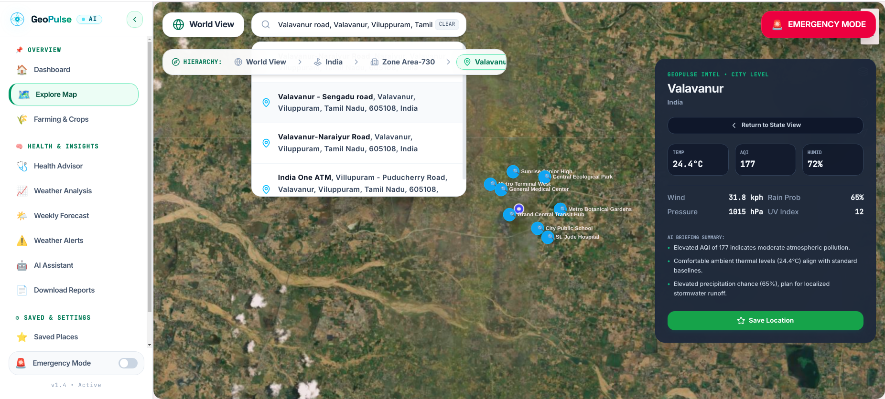
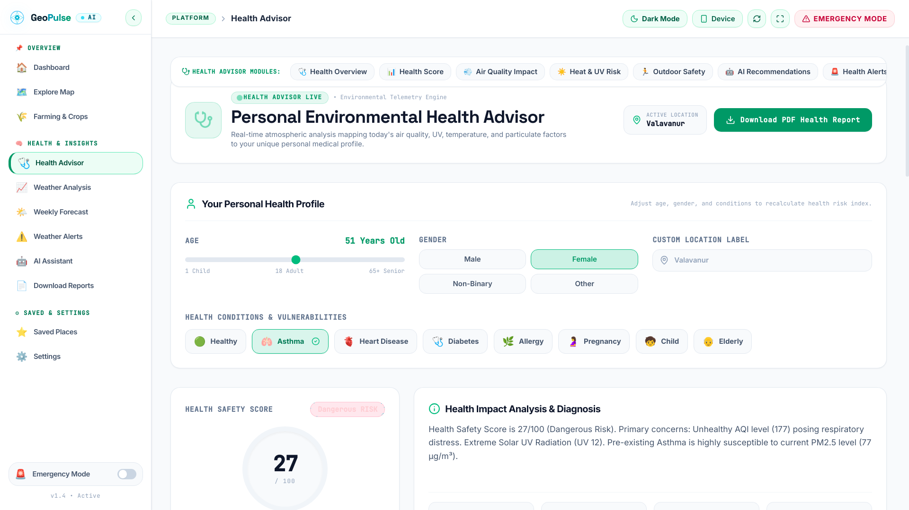
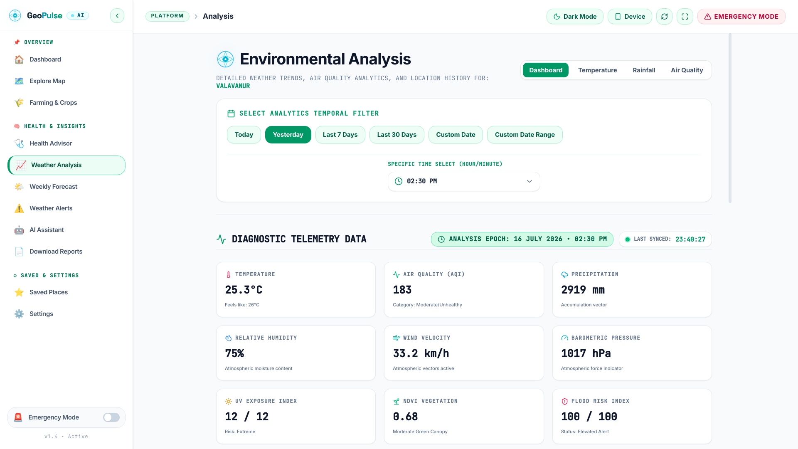
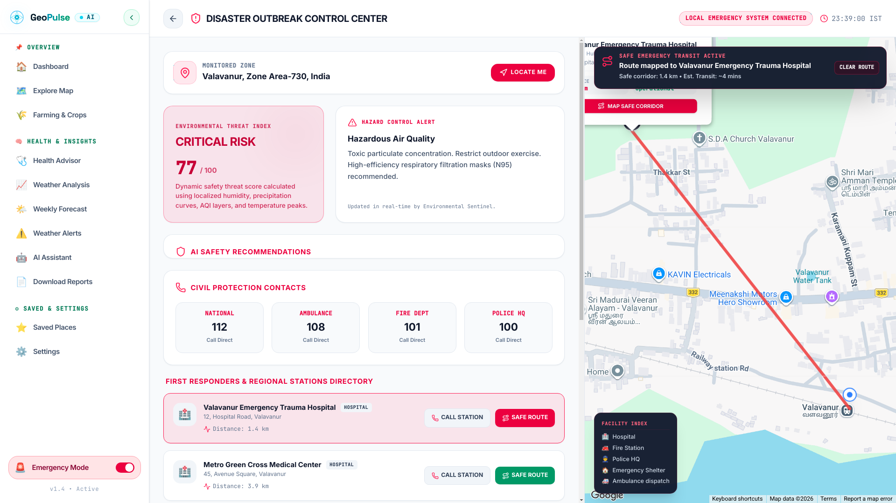

# 🌍 GeoPulse AI

## Intelligent Environmental Monitoring & Decision Support Platform

GeoPulse AI is an intelligent environmental monitoring platform designed to bring geographical exploration, environmental analysis, agriculture insights, forecasts, alerts, health information, emergency support, and reports together in a unified dashboard.

The platform provides users with an interactive way to explore environmental conditions and understand location-based information through a simple and intuitive interface.

---

# 🎯 Problem Statement

Environmental information is often scattered across different platforms and data sources.

Users may need to separately monitor:

- 🌡️ Temperature
- 💧 Humidity
- 🌧️ Rainfall
- 🌫️ Air Quality
- 🌱 Vegetation conditions
- 🌿 Environmental changes
- 🌦️ Forecast information
- 🚨 Environmental alerts
- 🗺️ Geographical information

This makes it difficult to quickly understand the environmental condition of a particular location.

## Our Goal

GeoPulse AI aims to provide a centralized platform where users can explore geographical information, analyze environmental conditions, monitor agricultural factors, view forecasts, access health-related insights, and receive important environmental alerts from one dashboard.

---

# 💡 Our Solution

GeoPulse AI combines an interactive geographical interface with environmental monitoring and analysis modules.

Users can search for or explore a location and access different environmental insights through the platform.

### GeoPulse provides:

- 🏠 Dashboard
- 🗺️ Explore Map
- 🌱 Farming & Crops
- ❤️ Health Advisor
- 📊 Weather Analysis
- 🌦️ Weekly Forecast
- 🚨 Weather Alerts
- 🤖 AI Assistant
- 📄 Download Reports
- ⭐ Saved Places
- ⚙️ Settings
- 🆘 Emergency Mode

The modular architecture also provides a foundation for integrating additional environmental datasets and machine learning capabilities.

---

# ✨ Key Features

## 🏠 Dashboard

The Dashboard provides an overview of GeoPulse and gives users quick access to the major environmental monitoring features.

It acts as the central entry point for exploring environmental information.

---

## 🗺️ Explore Map

The Explore Map provides an interactive geographical interface for exploring locations and environmental information.

### Features

- Location exploration
- Interactive geographical visualization
- Satellite map interface
- Location-based environmental information
- Map navigation
- Environmental monitoring

### Explore Map



---

## 🌱 Farming & Crops

The Farming & Crops module focuses on environmental information relevant to agriculture.

It provides a dedicated interface for exploring factors that can influence agricultural conditions.

### Applications

- Crop monitoring
- Vegetation monitoring
- Environmental condition analysis
- Agricultural planning
- Future precision agriculture integration

### Agriculture Dashboard


---

## ❤️ Health Advisor

The Health Advisor module provides environmental health-related information based on environmental conditions.

It provides a foundation for helping users understand how environmental factors may affect everyday health and outdoor activities.

### Possible Applications

- Air-quality awareness
- Heat-related conditions
- Weather-related health information
- Environmental exposure awareness

### Health Advisor



---

## 📊 Weather Analysis

The Weather Analysis module provides visual environmental information through interactive charts.

The interface can display information such as:

- 🌡️ Temperature
- 🌧️ Precipitation
- 🌫️ Atmospheric conditions
- 📈 Environmental trends

### Environmental Analysis Dashboard



The analysis dashboard helps users understand environmental patterns through visual representations and data-driven insights.

---

## 🌦️ Weekly Forecast

The Weekly Forecast module provides a dedicated interface for viewing upcoming weather and environmental conditions.

Forecast information can help users plan agricultural activities and understand expected environmental conditions.

---

## 🚨 Weather Alerts

The Weather Alerts module provides a centralized location for important environmental warnings.

### Possible Alert Categories

- Extreme weather
- Heavy rainfall
- Temperature-related risks
- Environmental hazards
- Air-quality concerns
- Location-based warnings

---

## 🤖 AI Assistant

The AI Assistant provides an interface for intelligent interaction with the GeoPulse platform.

It provides a foundation for future integration of AI-powered environmental assistance, analysis, recommendations, and natural-language interaction.

---

## 📄 Download Reports

The Reports feature provides users with access to environmental analysis information in a structured format.

Future versions can support:

- Environmental reports
- Historical analysis
- Location comparisons
- Trend summaries
- Downloadable reports

---

## ⭐ Saved Places

Users can save important locations for quick access later.

This can be useful for:

- Farms
- Research areas
- Monitoring locations
- Frequently visited places
- Environmental observation zones

---

## ⚙️ Settings

The Settings module provides application configuration and user preference options.

It gives users a centralized place to manage their GeoPulse experience.

---

## 🆘 Emergency Mode

Emergency Mode is designed to provide quick access to important information during environmental or emergency situations.

### Emergency Mode



The feature provides a foundation for future integration with emergency alerts, environmental risks, disaster information, and location-based response resources.

---

# 🖥️ Application Screenshots

## 🗺️ Explore Map


---

## 🌱 Agriculture


---

## 📊 Environmental Analysis

### Analysis View 1


### Analysis View 2

.png)

The Analysis module provides visual environmental indicators and analytical information for understanding selected locations.

---

## ❤️ Health Advisor


---

## 🆘 Emergency Mode


---

# 🧭 Platform Navigation

GeoPulse AI is organized into multiple modules to provide a complete environmental monitoring experience.

```text
GeoPulse AI
│
├── 🏠 Dashboard
│
├── 🗺️ Explore Map
│
├── 🌱 Farming & Crops
│
├── ❤️ Health Advisor
│
├── 📊 Weather Analysis
│
├── 🌦️ Weekly Forecast
│
├── 🚨 Weather Alerts
│
├── 🤖 AI Assistant
│
├── 📄 Download Reports
│
├── ⭐ Saved Places
│
├── ⚙️ Settings
│
└── 🆘 Emergency Mode
